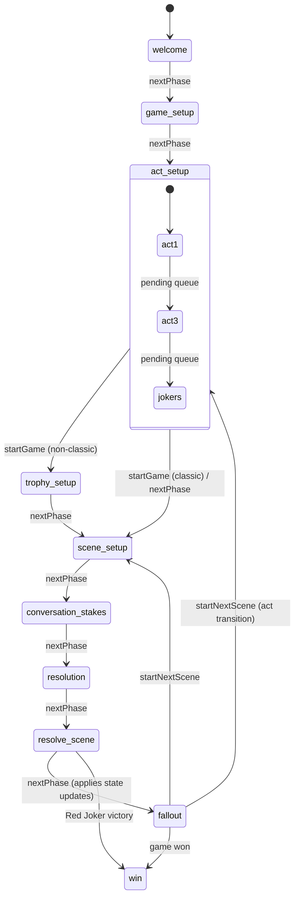

# Application Architecture Overview

## 1. Technology Stack

| Layer | Technology | Version | Purpose |
|-------|-----------|---------|---------|
| **Framework** | Vue 3 | ^3.3.0 | UI framework (Composition API, `<script setup>`) |
| **Language** | TypeScript | ~5.2.0 | Type safety (strict mode) |
| **Build Tool** | Vite | ^5.0.0 | Dev server and production bundler |
| **Styling** | Tailwind CSS | ^3.3.5 | Utility-first CSS framework |
| **Backend** | Firebase Realtime Database | ^12.6.0 | Online multiplayer state sync |
| **Markdown** | marked | ^17.0.1 | Rich text parsing for JSON content |
| **Testing** | Vitest + @vue/test-utils | ^1.6.1 / ^2.4.0 | Unit and component testing |
| **Linting** | Biome | ^2.3.8 | Code formatting and linting |
| **Git Hooks** | Husky | ^9.1.7 | Pre-commit/pre-push quality gates |

---

## 2. Project Structure

```
Night of the Thirteenth 2/
├── docs/                          # ← This documentation
├── NotT_2.md                      # Core game rules (markdown)
├── agents.md                      # Agent configuration
├── game_mechanics_master.md       # Compiled mechanics reference
├── playsets/                      # Physical playset assets
├── site/                          # ← The web application
│   ├── index.html                 # Entry point
│   ├── package.json               # Dependencies & scripts
│   ├── vite.config.ts             # Vite configuration
│   ├── tailwind.config.js         # Tailwind theme extension
│   ├── tsconfig.json              # TypeScript configuration
│   ├── biome.json                 # Linter/formatter config
│   ├── public/                    # Static assets
│   └── src/
│       ├── main.ts                # App bootstrap
│       ├── App.vue                # Root component & navigation
│       ├── style.css              # Global styles & CSS variables
│       ├── assets/                # Images, fonts, etc.
│       ├── components/            # Vue components (see §3)
│       ├── composables/           # Shared logic (see §4)
│       ├── data/                  # Game data & content (see §5)
│       └── utils/                 # Utilities (see §6)
```

### 2.1 Components Directory

```
components/
├── defaults/                      # Base implementations of design system components
│   ├── Button.vue                 # Default Button implementation
│   ├── Card.vue                   # Default Card implementation
│   ├── Text.vue                   # Default Text implementation
│   ├── ... (22 components)
│   └── __tests__/                 # Unit tests for all default components
├── live-play/                     # Live Play Helper feature
│   ├── LivePlayHelper.vue         # Main orchestrator (phase router)
│   ├── WelcomeScreen.vue          # Welcome phase
│   ├── GameSetup.vue              # Playset selection phase
│   ├── ActSetup.vue               # Act transition screens
│   ├── TrophySetup.vue            # Trophy pile initialization
│   ├── SceneSetup.vue             # Card draw & selection
│   ├── ManualCardEntry.vue        # Manual card input UI
│   ├── ConversationAndStakesPhase.vue  # Conversation phase
│   ├── PromptMatrix.vue           # Scene prompt display
│   ├── ScenePrompt.vue            # Individual prompt rendering
│   ├── ConversationPrompts.vue    # Sensory prompt suggestions
│   ├── ResolutionPhase.vue        # Dice rolling & modifiers
│   ├── ResolveScenePhase.vue      # Outcome narration
│   ├── FalloutPhase.vue           # Deck updates & consequences
│   ├── StrikeAssignmentModal.vue  # Strike assignment UI
│   ├── WinScreen.vue              # Victory screen
│   ├── LoseScreen.vue             # Defeat screen
│   ├── DebugPanel.vue             # Dev-only debug tools
│   └── __tests__/                 # Live play component tests
├── online-play/                   # Online Play Tool feature
│   ├── OnlinePlayTool.vue         # Lobby & game container
│   ├── SharedGameCanvas.vue       # Shared visual canvas (16:9)
│   └── canvas-elements/           # Canvas sub-components
│       ├── CanvasCard.vue          # Card rendering on canvas
│       ├── CanvasControls.vue      # Interactive controls overlay
│       └── CanvasZone.vue          # Positioned layout zone
├── rules/                         # Rules reference views
│   ├── RulesReference.vue         # Main rules page
│   ├── BasicRules.vue             # Core rules display
│   ├── CharacterRules.vue         # Character creation rules
│   └── FalloutReference.vue       # Fallout rules reference
├── playsets/                      # Playset-specific component overrides
│   └── summercamp/
│       └── PlayingCard.vue        # Summer Camp card styling
├── dev/                           # Development-only components
│   └── DesignSystem.vue           # Design system showcase
├── Button.vue                     # Wrapper (delegates to defaults/ or playsets/)
├── Card.vue                       # Wrapper
├── Text.vue                       # Wrapper
├── ... (21 wrapper components)
```

### 2.2 Composables Directory

```
composables/
├── useLivePlay.ts                 # Facade: unified API for all game logic
├── game/                          # Core game engine
│   ├── gameState.ts               # Singleton reactive state
│   ├── deckLogic.ts               # Card/deck manipulation
│   ├── phaseLogic.ts              # Phase FSM & resolution
│   └── types.ts                   # Core type definitions
├── online/                        # Online play
│   └── useGameStateSync.ts        # Firebase bidirectional sync
└── __tests__/                     # Game logic tests
    ├── useLivePlay.spec.ts
    ├── useLivePlay.basicRules.spec.ts
    ├── useLivePlay.act3.spec.ts
    └── useLivePlay.finalGirl.spec.ts
```

### 2.3 Data Directory

```
data/
├── rules.ts                       # Static rules data (effort scale, basic rules)
├── scenePrompts.ts                # Scene prompt logic & types
├── default/                       # Default playset content (21 JSON files)
│   ├── config.json                # Playset metadata
│   ├── prompts.json               # Scene prompt matrix (suit × rank)
│   ├── welcomeScreen.json         # Welcome screen text
│   ├── gameSetup.json             # Game setup text
│   ├── actSetup.json              # Act transition text (per act)
│   ├── conversationAndStakes.json # Conversation phase text
│   ├── resolutionPhase.json       # Resolution phase text
│   ├── resolveScenePhase.json     # Scene outcome text
│   ├── falloutPhase.json          # Fallout phase text
│   ├── trophySetup.json           # Trophy setup text
│   ├── manualCardEntry.json       # Manual card entry labels
│   ├── sceneSetup.json            # Scene setup text & guidance
│   ├── sensoryPrompts.json        # "Focus the Camera" suggestions
│   ├── strikeAssignment.json      # Strike assignment labels
│   ├── winScreen.json             # Victory screen text
│   ├── loseScreen.json            # Defeat screen text
│   ├── livePlayHeader.json        # Header labels
│   ├── header.json                # App header config
│   ├── css.json                   # Theme colors & fonts
│   ├── rulesModules.json          # Rules module definitions
│   └── uiLabels.json              # Misc UI labels
├── generic_slasher_classic/       # Classic Setup playset override
│   ├── config.json                # Enables classicSetup module
│   └── actSetup.json              # Custom act setup text
└── summercamp/                    # Summer Camp Massacre playset override
    ├── config.json                # Enables finalGirl module
    ├── actSetup.json              # Custom act setup text
    └── css.json                   # Custom color theme
```

### 2.4 Utils Directory

```
utils/
├── contentLoader.ts               # JSON data loading & playset merging
├── theme.ts                       # Runtime CSS variable updates
├── firebase.ts                    # Firebase app initialization
└── __tests__/
    └── contentLoader.spec.ts
```

---

## 3. Architecture Patterns

### 3.1 Shared State Singleton

The application uses a **Shared State Singleton** pattern rather than a dedicated state management library (Vuex/Pinia). All mutable game state lives in `gameState.ts` as module-level `ref()` exports.

```
┌─────────────────────────────────────────────────────┐
│                    Components                        │
│  (LivePlayHelper, SceneSetup, FalloutPhase, etc.)   │
└───────────────────┬─────────────────────────────────┘
                    │ imports
                    ▼
┌─────────────────────────────────────────────────────┐
│              useLivePlay.ts (Facade)                 │
│  Re-exports state + methods from sub-modules         │
│  Computes UI-specific derived state                  │
└───────┬──────────────┬──────────────┬───────────────┘
        │              │              │
        ▼              ▼              ▼
┌──────────────┐ ┌──────────────┐ ┌──────────────┐
│ gameState.ts │ │ deckLogic.ts │ │ phaseLogic.ts│
│   (State)    │ │   (Cards)    │ │  (Phases)    │
│              │◄┤              │◄┤              │
│ refs         │ │ queries      │ │ transitions  │
│ computeds    │ │ mutations    │ │ resolution   │
└──────────────┘ └──────────────┘ └──────────────┘
```

**Why this pattern?**

- **Simplicity:** No additional library overhead for what is fundamentally a single-player (with optional sync) state machine.
- **Direct Reactivity:** Vue's reactivity system (`ref`, `computed`) provides everything needed.
- **Singleton Guarantee:** Module-level exports in ES modules are naturally singletons.
- **Testability:** State can be reset via `fullReset()` between tests.

### 3.2 Facade Pattern (useLivePlay)

`useLivePlay.ts` is a **Facade composable** — it doesn't contain significant logic itself. Instead, it re-exports state from `gameState.ts` and methods from `deckLogic.ts` and `phaseLogic.ts`, providing a single import point for components.

It also computes a few UI-specific derived values:
- `selectedSuit`, `selectedRank` (from `activeCard`)
- `isFaceCard` (type check with fallback inference)
- `isWelcomePhase`, `isFirstWeakness` (UI-layer checks)
- `cardName` (human-readable rank name)
- `availableTrophyRanks` (unique ranks in trophy pile)
- `hasFaceCardOnTable` (any face card visible)

### 3.3 Component Wrapper Pattern

Design system components use a two-layer architecture:

1. **Default Component** (`components/defaults/Button.vue`): Contains the actual implementation — template, styles, logic.
2. **Wrapper Component** (`components/Button.vue`): Dynamically loads either the default or a playset-specific override.

The wrapper uses `import.meta.glob` to discover playset components, `watchEffect` to react to playset changes, and `<component :is="...">` for dynamic rendering. All props are passed through transparently.

This enables playsets to visually customize any component without modifying the default implementation.

### 3.4 Data-Driven Content

All substantial text content lives in JSON files under `data/`. Components never hardcode text strings. Instead:

1. Component calls a content loader function (e.g., `getWelcomeScreenContent(playsetId)`)
2. `contentLoader.ts` loads the default JSON, then deep-merges any playset override
3. The merged content is returned with Markdown parsed via `marked`
4. Component binds the content to its template

This separation allows:
- Content updates without code changes
- Localization (future)
- Playset-specific text overrides
- Rich text via Markdown in JSON

---

## 4. Phase Lifecycle (Finite State Machine)

The game progresses through a series of phases, managed by `phaseLogic.ts`.



### Phase Descriptions

| Phase | Component | Purpose |
|-------|-----------|---------|
| `welcome` | WelcomeScreen | Introduction and game overview |
| `game-setup` | GameSetup | Playset selection |
| `act-setup` | ActSetup | Act transition interstitials (Act 1, Act 3, Jokers) |
| `trophy-setup` | TrophySetup | Manual Trophy Pile initialization (non-classic mode) |
| `scene-setup` | SceneSetup | Draw and select Threat Cards |
| `conversation-stakes` | ConversationAndStakesPhase | Scene narration and sacrifice definition |
| `resolution` | ResolutionPhase | Dice rolling, modifiers, aptitude |
| `resolve-scene` | ResolveScenePhase | Outcome display and effort narration |
| `fallout` | FalloutPhase | Deck updates, strikes, genre points, consequences |
| `win` | WinScreen / LoseScreen | Game conclusion |

---

## 5. Application Views

The app has four main views, controlled by `App.vue`:

| View | Component | Description |
|------|-----------|-------------|
| **Live Play Helper** | `LivePlayHelper` | The core game assistant — walks through each phase of the game loop. |
| **Online Play** | `OnlinePlayTool` | Multiplayer mode — embeds the Live Play Helper alongside a shared visual canvas. |
| **Rules Reference** | `RulesReference` | Static rules display for quick reference during play. |
| **Design System** | `DesignSystem` | Dev-only showcase of all design system components. |

Navigation between views uses `NavButton` components in a `Navigation` bar within the app `Header`.

The Online Play view enters an "immersive" mode: full-screen, no padding, no header. Exit returns to the Live Play view.

---

## 6. Testing Strategy

### 6.1 Framework

- **Vitest** for test running
- **@vue/test-utils** for component testing
- **jsdom** as the DOM environment

### 6.2 Test Commands

| Command | Purpose |
|---------|---------|
| `npm run test:ci` | Run all tests once (CI mode, no watch) |
| `npm run test` | Alias for `test:ci` |

### 6.3 Test Coverage

| Area | Test Files | Coverage |
|------|-----------|----------|
| Default Components | 21 spec files | All props, slots, events, variant classes |
| Game Logic | 4 spec files | Basic rules, Act 3, Final Girl, general flow |
| Live Play Components | 3 spec files | ManualCardEntry, ResolutionPhase, TrophySetup |
| Utilities | 1 spec file | contentLoader |

### 6.4 Quality Gates

**Husky** enforces quality via git hooks:
- **Pre-commit:** Runs `npm run test:ci`
- **Pre-push:** Runs `npm run test:ci`

---

## 7. Build & Deployment

### 7.1 Development

```bash
cd site
npm run dev          # Start Vite dev server
```

### 7.2 Production Build

```bash
cd site
npm run build        # Vite production build → dist/
npm run preview      # Preview production build locally
```

### 7.3 Environment Variables

Firebase configuration is loaded from `site/.env.local`:

```
VITE_FIREBASE_API_KEY=...
VITE_FIREBASE_AUTH_DOMAIN=...
VITE_FIREBASE_DATABASE_URL=...
VITE_FIREBASE_PROJECT_ID=...
VITE_FIREBASE_STORAGE_BUCKET=...
VITE_FIREBASE_MESSAGING_SENDER_ID=...
VITE_FIREBASE_APP_ID=...
```

These are required for the Online Play feature to function.
