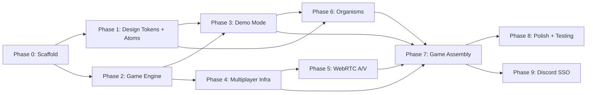

# Night of the Thirteenth 2 — Online Multiplayer Implementation Plan

> **Status**: Phases 0–6 Complete · Phase 7 Next  
> **Last Updated**: 2026-04-26  
> **Target**: 4-player online multiplayer horror TTRPG with audio/video

---

## Decisions Register

| Decision | Choice | Locked |
|----------|--------|--------|
| Framework | Next.js (App Router, SSR) | ✅ |
| WebRTC | Raw WebRTC + Firebase Signaling | ✅ |
| State Management | Zustand (slice architecture) | ✅ |
| Styling | Vanilla Extract (zero-runtime, type-safe) | ✅ |
| Project Structure | Turborepo monorepo | ✅ |
| Design System | Storybook 8 + Atomic Design (CSF3) | ✅ |
| Dice | `react-ttrpg-dice` integration (animated 3D) | ✅ |
| Auth | Firebase Anonymous Auth → Discord SSO (Phase 9) | ✅ |
| Testing | Vitest + React Testing Library + Playwright | ✅ |
| CSS Framework | No Tailwind — Vanilla Extract only | ✅ |
| Demo Mode | 1-player demo from day 0 | ✅ |

---

## Phase Overview

| Phase | File | Goal | Dependencies |
|-------|------|------|-------------|
| **0** | [00-monorepo-scaffold.md](./00-monorepo-scaffold.md) | Turborepo + Next.js + packages skeleton | None |
| **1** | [01-design-system-foundation.md](./01-design-system-foundation.md) | Tokens, atoms, Storybook, Vanilla Extract | Phase 0 |
| **2** | [02-game-engine.md](./02-game-engine.md) | Pure TS game logic, full rule coverage | Phase 0 |
| **3** | [03-demo-mode.md](./03-demo-mode.md) | 1-player demo — playable solo from day 0 | Phase 1 + 2 |
| **4** | [04-multiplayer-infrastructure.md](./04-multiplayer-infrastructure.md) | Firebase RTDB, anonymous auth, rooms, state sync | Phase 2 |
| **5** | [05-webrtc-audio-video.md](./05-webrtc-audio-video.md) | Raw WebRTC, Firebase signaling, video grid | Phase 4 |
| **6** | [06-design-system-organisms.md](./06-design-system-organisms.md) | Game-specific UI components | Phase 1 + 3 |
| **7** | [07-game-assembly.md](./07-game-assembly.md) | Full game pages, all phases wired up | Phase 3–6 |
| **8** | [08-polish-and-testing.md](./08-polish-and-testing.md) | E2E tests, perf, a11y, production readiness | Phase 7 |
| **9** | [09-discord-sso.md](./09-discord-sso.md) | Discord SSO, Hybrid Auth, Patreon Role gating | Phase 7 |



---

## Monorepo Structure (Target)

```
nott2-online/
├── apps/
│   └── web/                          # Next.js application
├── packages/
│   ├── design-system/                # Storybook + component library
│   ├── game-engine/                  # Pure TypeScript game logic
│   └── multiplayer/                  # Firebase sync + WebRTC
├── turbo.json
├── package.json
└── tsconfig.base.json
```

---

## Skills Available

13 agent skills installed to guide implementation. See individual phase files for which skills apply to each phase.

| Skill | Source | Primary Phase |
|-------|--------|--------------|
| `vercel-react-best-practices` | Vercel | All React work |
| `vercel-composition-patterns` | Vercel | Phase 1, 6 |
| `next-best-practices` | Vercel | Phase 0, 7 |
| `firebase-basics` | Firebase | Phase 4 |
| `next-auth-v5` | Auth.js | Phase 9 |
| `storybook-story-writing` | Bushido | Phase 1, 6 |
| `typescript-advanced-types` | wshobson | Phase 2 |
| `zustand` | LobeHub | Phase 3, 4, 7 |
| `multiplayer-game` | Rivet | Phase 4, 5 |
| `webapp-testing` | Anthropic | Phase 8 |
| `playwright-best-practices` | Currents | Phase 8 |
| `frontend-design` | Anthropic | Phase 1, 6 |
| `web-design-guidelines` | Vercel | Phase 1, 6, 7 |
